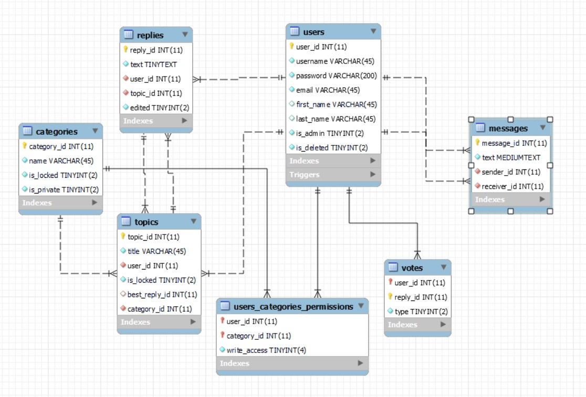

# ForumAPI System

Back-end web application, programmed in Python and designed to implement a Forum System and provide RESTful API.

## Technologies Used

**Database**: MariaDB

**Web Server**: Uvicorn

**API**: FastAPI

**Authentication**: OAuth2 with JWT

**Testing**: Unittest

## Installion and setup

### 1. Clone the project using HTTPS

```
git clone https://github.com/ForumTelerik/forum.git
```

### or SSH

```
git clone git@github.com:ForumTelerik/forum.git
```

### 2. Install the packages listed in the **requirements.txt** file in a virtual environment using pip and venv (make sure you're in the `forum/server` directory)

**Inctructions on creating and activating a virtual environment:** [Link](https://packaging.python.org/en/latest/guides/installing-using-pip-and-virtual-environments/)

```
pip install -r requirements.txt
```

### 3. Start the application (`forum/server` directory)

```
uvicorn main:app --reload
```

### 4. Swagger docs: [Link](http://127.0.0.1:8000/docs)

Available when you run the server (step 3).

## Features

- Public endpoints - accessible without authentication;
- Login endpoints - require login with username and password; Marked with a lock on Swagger;
  
- **Features, related to users:**
  * User register;
  * User login;
  * View all users;
  * Update user's first name and or last name;
  * Delete user;
  * View single user;
  * Change user password;

- **Features, related to topic categories:**
  * View all categories;
  * View single category;

- **Features, related to topics:**
  * View all topics;
  * Create a topic;
  * View single topic with its replies;
  * Choose best reply to a topic (only topic author);
  * Lock or unlock a topic (a locked topic no longer accepts new replies - only topic author);

- **Features, related to admins:**
  * Create a category;
  * Make a category public or private;
  * Lock or unlock a category (a locked category no longer accepts new topics)
  * Give a user read access to a private category;
  * Revoke a user's read access to a private category;
  * Give or revoke a user's write access to a private category;
  * View all priviliged users for a private category;
  * Lock or unlock a topic;

- **Features, related to topic replies:**
  * Add reply to a topic;
  * Edit reply to a topic;
  * Delete reply to a topic;

- **Features, related to reply votes:**
  * Show all votes for reply by type (upvote | downvote);
  * Vote for a reply or switch vote's type;
  * Remove vote;

- **Features, related to messages:**
  * Send message to another user;
  * View all messages with another user;
  * View all users you've exchanged messages with;
  * Edit a message;

## Database


